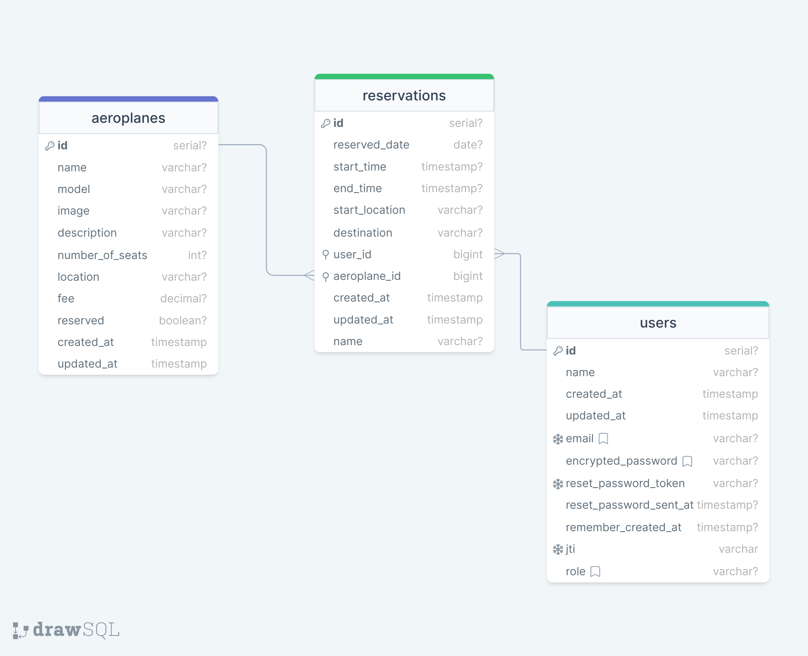

<div align="center">
 
  <br/>
  <h1><b>JetLogix</b></h1>

<div align="center">
<h2>ER Diagrma</h2>


</div>

</div>

<a name="readme-top"></a>

<!-- TABLE OF CONTENTS -->

# 📗 Table of Contents

- [📖 About the Project](#about-project)
  - [🚀 Front End](#front-end)
  - [🛠 Built With](#built-with)
    - [Tech Stack](#tech-stack)
    - [Key Features](#key-features)
  - [🚀 Live Demo](#live-demo)
- [💻 Getting Started](#getting-started)
  - [Setup](#setup)
  - [Prerequisites](#prerequisites)
  - [Install](#install)
  - [Usage](#usage)
  - [Setup .ENV](#setup-env)
  - [Run tests](#run-tests)
  - [Deployment](#triangular_flag_on_post-deployment)
- [📆 Kanban Board ](#kanban-board)
- [👥 Authors](#authors)
- [🔭 Future Features](#future-features)
- [🤝 Contributing](#contributing)
- [⭐️ Show your support](#support)
- [🙏 Acknowledgements](#acknowledgements)
- [🙏 Attribution](#attribution)
- [❓ FAQ](#faq)
- [📝 License](#license)

<!-- PROJECT DESCRIPTION -->

# 📖 [JetLogix] <a name="about-project"></a>

JetLogix’s backend is a robust Rails application utilizing PostgreSQL database, managing private jet reservations. It exposes efficient API endpoints to JetLogix front, providing access to the application’s database and ensuring secure storage and retrieval private jets, user's, and reservation data.

## 🚀 FrontEnd <a name="front-end"></a>

[Click here to see the JetLogix front end](https://github.com/rubydevi/jetlogix-frontend)

## 🛠 Built With <a name="built-with"></a>

### Tech Stack <a name="tech-stack"></a>

  <ul>
    <li><a href="https://rubyonrails.org/">Rails</a></li>
  </ul>

  <ul>
    <li><a href="https://www.ruby-lang.org/en/">Ruby</a></li>
  </ul>

  <ul>
    <li><a href="https://www.mysql.com/">PSQL</a></li>
  </ul>

  <ul>
    <li><a href="https://www.mysql.com/">RSpec-Rails</a></li>
  </ul>

  <ul>
    <li><a href="https://teamcapybara.github.io/capybara/">Capybara-Rails</a></li>
  </ul>

  <ul>
    <li><a href="https://github.com/CanCanCommunity/cancancan">Cancan</a></li>
  </ul>

  <ul>
    <li><a href="https://github.com/heartcombo/devise">Devise</a></li>
  </ul>

  <ul>
    <li><a href="https://github.com/ged/ruby-pg">Ruby Pg</a></li>
  </ul>

  <ul>
    <li><a href="https://github.com/rswag/rswag">Rswag</a></li>
  </ul>

<!-- Features -->

### Key Features <a name="key-features"></a>

> Exposes robust API endpoints to manage and access the application’s rich database.

> Controllers to manage jets and reservations, allowing CRUD (Create, Read, Update, Delete) operations.

> Secure user authentication and profile management
> API documentation

<!-- <p align="right">(<a href="#readme-top">back to top</a>)</p> -->

<!-- LIVE DEMO -->

## 🚀 Live Demo <a name="live-demo"></a>

> Live Demo of this application:

- [Live Demo Link](https://jetlogix.onrender.com/)

<p align="right">(<a href="#readme-top">back to top</a>)</p>

<!-- GETTING STARTED -->

## 💻 Getting Started <a name="getting-started"></a>

To get a local copy up and running, follow these steps.

### Prerequisites

In order to run this project you need:

### Setup

Clone this repository to your desired folder:

```sh
  cd my-folder
  git clone https://github.com/rubydevi/jetlogix-backend.git
```

### Install

Install this project with:

```sh
  cd my-project

  bundle install
```

### setup-env

1. create an env file by running the following command

```sh
  touch .env
```

Or create the .env file manually at the root of the application.

2. open databse.yml file and Find the default: &default section in the file and copy the credentials into your .env file:

```sh
  DATABASE_USERNAME=your_username
  DATABASE_PASSWORD=your_password
```

### Usage

To run the project, you will need to execute:

```sh
  rails credentials:edit

  rails db:create

  rails db:migrate

  rails db:seed

  rails s
```

### Run tests

To run tests, run the following command:

```sh
  rails db:migrate RAILS_ENV=test
  rspec spec/model/
```

<!-- ### Deployment

You can deploy this project using: -->

<!--
Example:

```sh

```
 -->

<p align="right">(<a href="#readme-top">back to top</a>)</p>

## 📆 Kanban Board <a name="kanban-board"></a>

- [Kanban board](https://github.com/rubydevi/jetlogix-backend/projects/1)

- [Kanban board initial state ](https://user-images.githubusercontent.com/112550568/279359779-a877a136-d14e-4813-8868-68b5b7aec9e6.png)

- We are a team of 3 members as indicated in the authors section
<!-- CONTRIBUTING -->

<!-- AUTHORS -->

## 👥 Authors <a name="authors"></a>

👤 Chongtham Ruby Devi

- GitHub: [@rubydevi](https://github.com/rubydevi)
- LinkedIn: [@Chongtham Ruby Devi](https://www.linkedin.com/in/chongtham-bhoomika/)

👤 Yonas Henok

- GitHub: [@YonasHenok](https://github.com/Yonashenok)
- Twitter: [@YonasHenok3](https://www.twitter.com/YonasHenok3)
- LinkedIn: [@Yonas Henok](https://www.linkedin.com/in/yonas-henok/)

👤 Riley Manda

- GitHub: [@RileyManda](https://github.com/RileyManda)
- Twitter: [@rilecodez](https://twitter.com/rileycodez)
- LinkedIn: [rileymanda](https://www.linkedin.com/in/rileymanda/)

<p align="right">(<a href="#readme-top">back to top</a>)</p>

<!-- FUTURE FEATURES -->

## 🔭 Future Features <a name="future-features"></a>

> Video Presentation demo of the project

> Deploy the application on render

<p align="right">(<a href="#readme-top">back to top</a>)</p>

<!-- Kanban Board -->

## 🤝 Contributing <a name="contributing"></a>

Contributions, issues, and feature requests are welcome!

Feel free to check the [issues page](https://github.com/rubydevi/jetlogix-backend/issues).

<p align="right">(<a href="#readme-top">back to top</a>)</p>

<!-- SUPPORT -->

<!-- SUPPORT -->

## <b>Show your support 🌟</b><a name="support"></a>

Thank you for taking the time to explore this project! Your support means a lot to me. If you find my project valuable and would like to contribute, here is one way you can support me:

- <b>Star the project ⭐️</b>: Show your appreciation by starring this GitHub repository. It helps increase visibility and lets others know that the project is well-received.

- <b>Fork the project 🍴 🎣</b>: If you're interested in making improvements or adding new features, feel free to fork the project. You can work on your own version and even submit pull requests to suggest changes.

- <b>Share with others 🗺️</b>: Spread the word about this project. Share it on social media, mention it in relevant forums or communities, or recommend it to colleagues and friends who might find it useful.

<p align="right">(<a href="#readme-top">back to top</a>)</p>

<!-- ACKNOWLEDGEMENTS -->

## 🙏 Acknowledgments <a name="acknowledgements"></a>

We would like to express my sincere gratitude to [Microverse](https://github.com/microverseinc), the dedicated reviewers, and collaborators. Your unwavering support, feedback, and collaborative efforts have played an immense role in making this journey a resounding success.
A big thank you to [Murat Korkmaz](https://www.behance.net/muratk) for the providing the UX design inspiration for this project.

<p align="right">(<a href="#readme-top">back to top</a>)</p>

<!-- FAQ (optional) -->

## ❓ FAQ <a name="faq"></a>

- **Question_1**

  Do I have to use the vs code specifically?

  - Answer_1

    You can use any one of your favortite or prefered editors<br>

<p align="right">(<a href="#readme-top">back to top</a>)</p>

<!-- ATTRIBUTION -->

## 👥 Attribution <a name="attribution"></a>

- This application's front-end UI design is based on the original design by: [Murat Korkmaz](https://www.behance.net/muratk)

<!-- LICENSE -->

## 📝 License <a name="license"></a>

[](./LICENSE)

<p align="right">(<a href="#readme-top">back to top</a>)</p>
